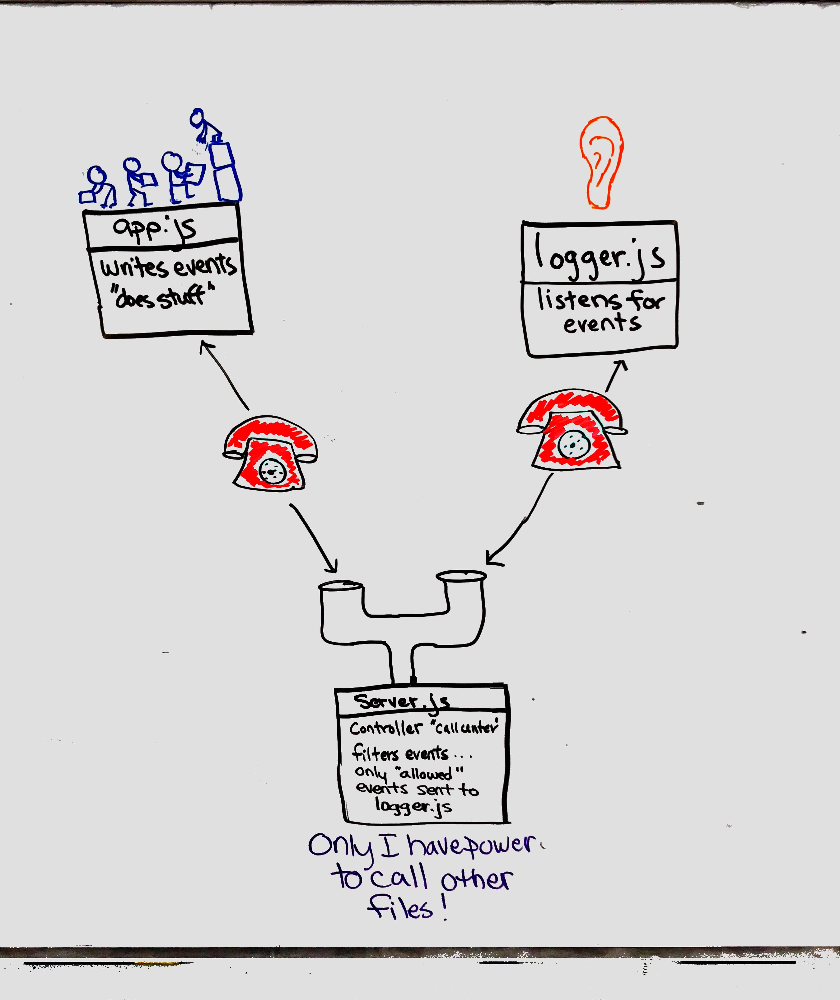

 LAB
=================================================

## TCP Chat Server

### Author: Erin Trainor

### Links and Resources
* [pull request](https://github.com/401-advanced-javascript-401d29/lab-17/pull/1)
* [travis](https://www.travis-ci.com/401-advanced-javascript-401d29/lab-17)

#### Documentation
* [jsdoc](ocalhost:3001/docs)

#### Running the app
* Within first terminal window
  * `nodemon server.js`
* Within the second terminal window
  * `nc localhost 3001`
* Within the third terminal window
  * `nodemon logger.js`
* To run save functionality
  * `npm app.js .files/test.txt`
  
#### Tests
* How do you run tests?
  * npm run test
* What assertions were made?
  * that the files are linked
* What assertions need to be / should be made?
  * more function specific testing

#### UML

